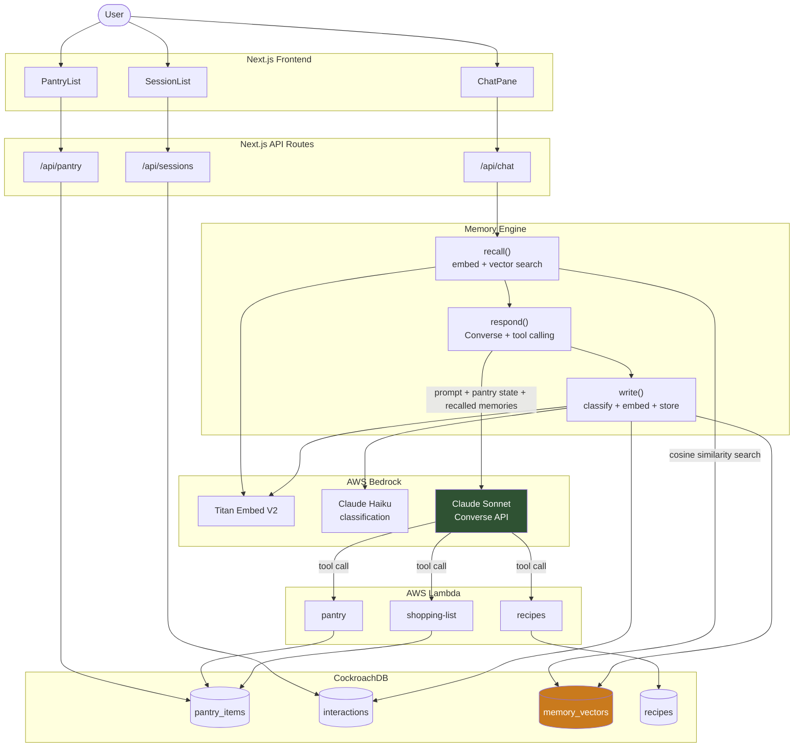

# PantryMind

**Remembers what you actually cook.**

PantryMind is an agentic pantry assistant. It tracks what's in your kitchen, tells you what's about to expire, suggests what to cook, and — the core of it — actually remembers you across conversations. Tell it once that you don't eat red meat or that you let spinach go bad last week, and every future recommendation factors that in, with the exact memory it recalled shown alongside the answer.

## Features

- **Conversational pantry assistant** — ask what's expiring, what to cook, or just talk through what you have. Answers are grounded in your real, current pantry contents, not a static description.
- **Cross-session memory** — preferences, feedback, and waste patterns you mention are captured automatically and recalled by similarity on future messages, even in a brand-new conversation. Each recall shows the exact memory retrieved and its similarity score.
- **Pantry management UI** — add, edit, and remove items by hand, with quantity, unit, category, and expiry date. Items near expiry are visually flagged.
- **Assistant-driven pantry actions** — the assistant can add items, adjust quantities, mark things consumed or wasted, and look up expiring items on your behalf, as part of a normal conversation.
- **Recipe matching** — finds recipes from your current ingredients, prioritizing what's closest to expiring, and automatically filters out anything you've said you dislike or avoid.
- **Shopping list generation** — given a set of recipes, works out what's still missing from your pantry.
- **Session history** — every conversation is saved and browsable, so cross-session recall is something you can actually see happen, not just take on faith.

## Architecture



Every chat turn follows the same loop: the incoming message is embedded and matched against past memories, the match results and current pantry state are handed to Claude alongside the conversation, the model calls real tools when it needs to act (add an item, adjust a quantity, look up a recipe), and once a reply is ready, the exchange is classified and — if it contains a durable fact — embedded and stored for future recall.

## Tech stack

**Frontend** — Next.js (App Router), React, CSS Modules.

**Database — CockroachDB**
CockroachDB is the system of record for everything: pantry inventory, conversation history, and memory. Memory recall specifically relies on CockroachDB's native vector search — memories are stored as `VECTOR` columns and queried with a distributed vector index, so similarity search runs directly in the database rather than through a separate vector store.

| Table | Purpose |
|---|---|
| `users` | The account a session belongs to. |
| `pantry_items` | Current inventory — name, quantity, unit, category, expiry date, and status (active/consumed/wasted). |
| `interactions` | Full conversation log, one row per message, grouped by session. |
| `memory_vectors` | Durable facts extracted from conversation — preferences, feedback, waste patterns — each stored with a 1024-dimension embedding for similarity search. |
| `recipes` | Cached recipe results, keyed by ingredients, for fast repeat lookups. |

**AI — AWS Bedrock**
- **Claude Sonnet**, via the Converse API, drives the conversation and calls tools when it needs to take an action.
- **Claude Haiku** classifies each exchange (preference, feedback, action, or general chatter) to decide whether it's worth remembering.
- **Titan Embeddings** turns both incoming messages and durable facts into vectors for similarity search.

**Compute — AWS Lambda**
Three functions handle the pantry domain and are called directly as tools during conversation:
- `pantry` — add, list, update, and retire items; look up what's expiring soon.
- `recipes` — match recipes against current ingredients, ranked by what's closest to expiring, filtered by stated preferences.
- `shopping-list` — diff a set of recipes' ingredients against current pantry contents.

**Hosting** — the frontend and its API routes run on Vercel; Lambda functions are deployed via AWS SAM.

## Project structure

```
apps/web/            Next.js frontend + API routes
packages/memory/      Recall, classify, write, and the Bedrock Converse loop
packages/shared/       Shared types, DB access, validation
lambda/                 Pantry, recipes, and shopping-list Lambda functions
scripts/                 Database schema and seed data
```
